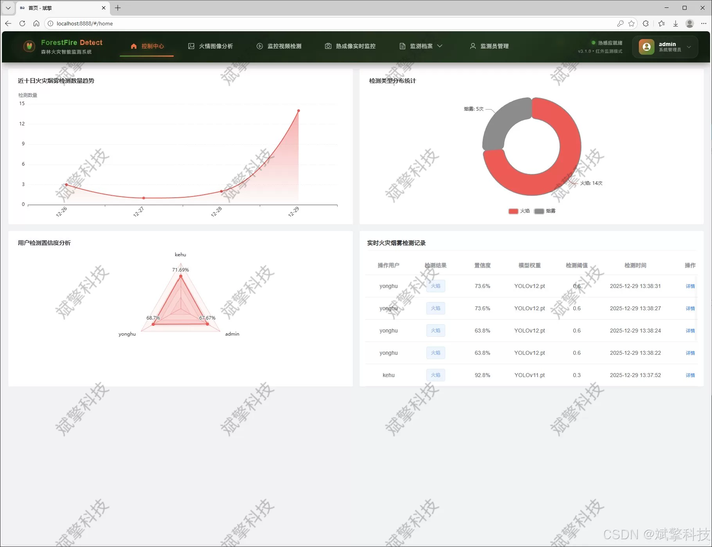
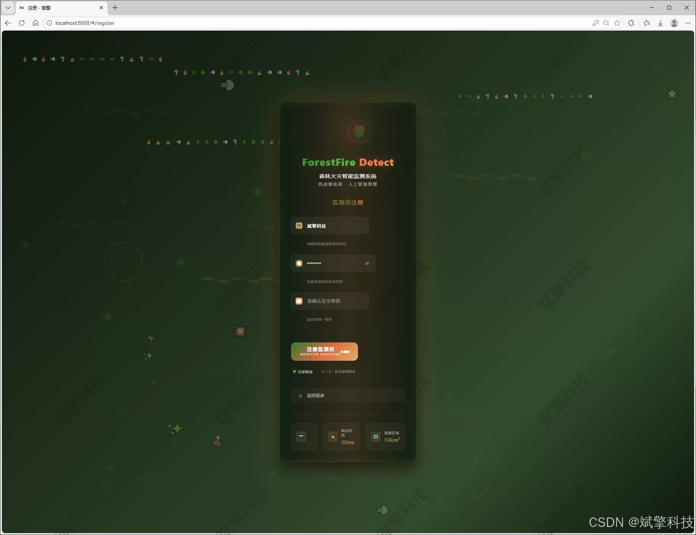
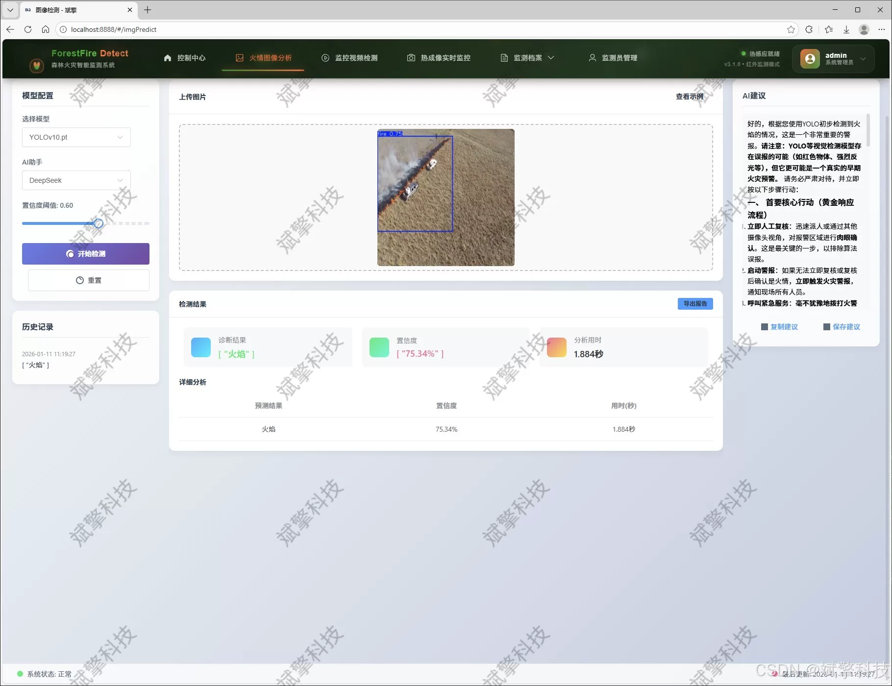
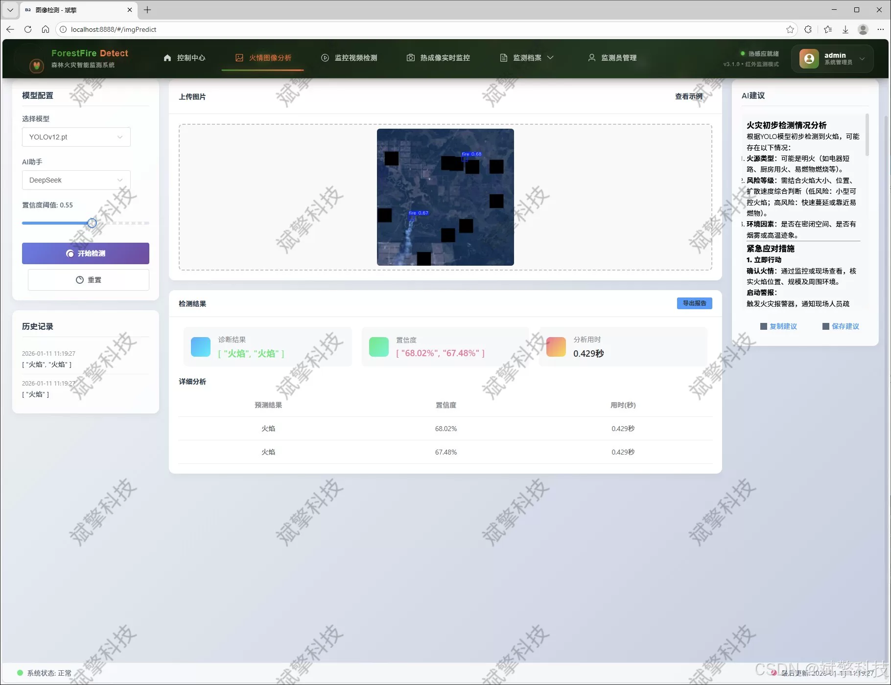
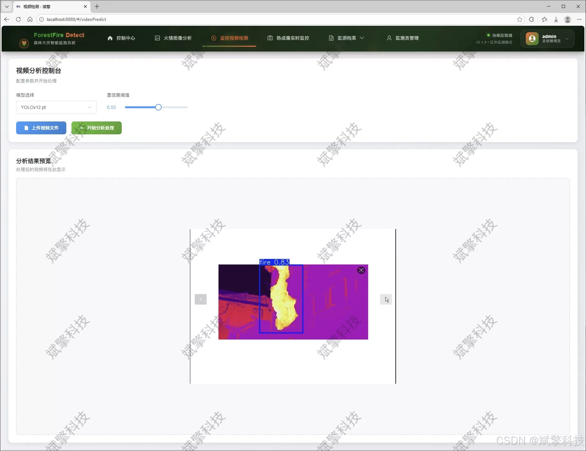
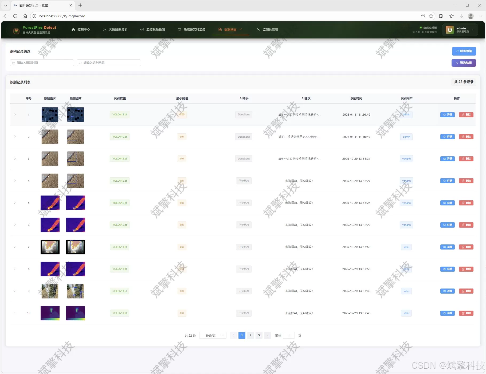
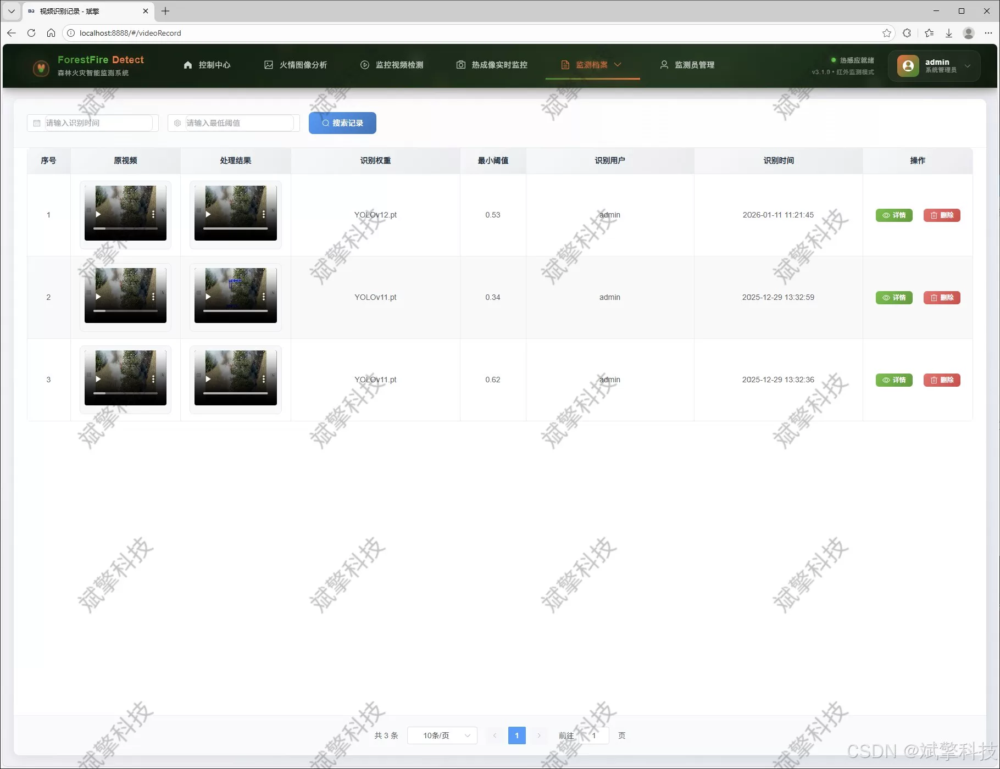
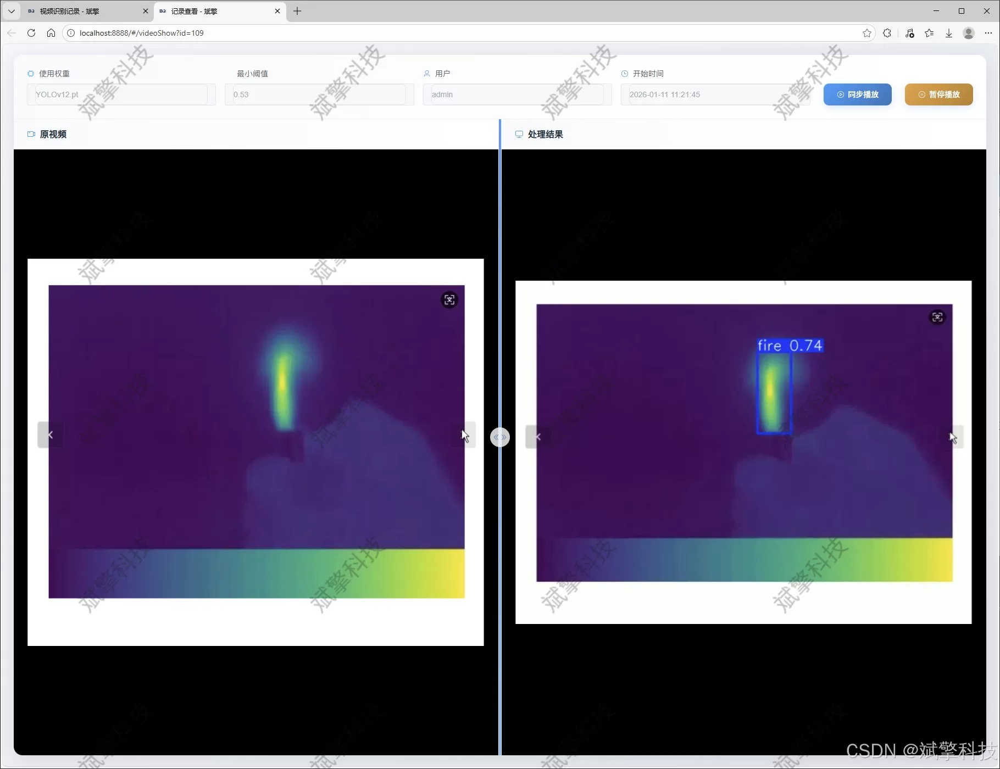
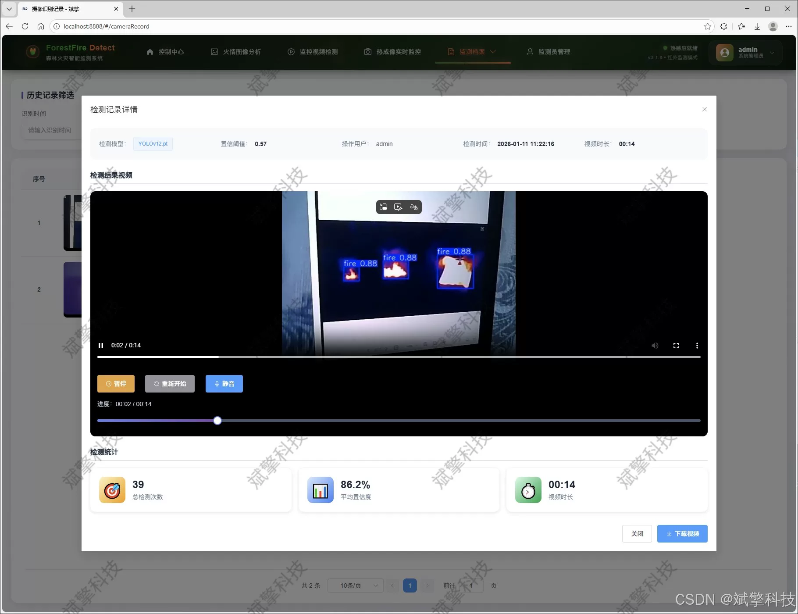

# YOLO+DeepSeek Forest Fire Prevention System

## Body

The YOLO+DeepSeek forest fire detection system is based on the YOLO deep learning and the large models of Qianwen and DeepSeek. The system includes a web interface for intelligent analysis, a front-end and back-end separation, YOLO data, and YOLOv8/YOLOv10/YOLOv11/YOLOv12.

Forest fires are a significant ecological security challenge facing the world. Early detection and early warning of fire situations are crucial for protecting the ecological environment and the safety of people's lives and property. This study designs and implements a forest fire smoke intelligent detection system that integrates advanced deep learning technology with modern Web architecture. The system innovatively integrates four latest target detection models: YOLOv8, YOLOv10, YOLOv11, and YOLOv12, specifically targeting the key characteristics of "fire" and "smoke" for high-precision recognition. The system is built using SpringBoot framework to construct the backend service, combined with a front-end-back-end separation architecture, achieving multimodal fire situation detection functions (including static images, dynamic video streams, and real-time surveillance cameras), and storing all detection records in MySQL database. To enhance the level of intelligence of the system, we innovatively introduce the DeepSeek large language model to provide intelligent analysis and risk assessment reports for fire situation detection results. Experimental results show that the system performs excellently on a professional fire smoke dataset containing 2000 labeled images, achieving the expected detection accuracy. The system also comes equipped with comprehensive management features, including user identity authentication, detection record visualization analysis, and administrator back-end management modules, providing a complete, efficient, and intelligent technical solution for forest fire prevention work.

Functional module

✅ User Login and Registration: Supports password detection, saves to MySQL database.

✅ Supports four YOLO model switches, YOLOv8, YOLOv10, YOLOv11, YOLOv12.

✅ Information Visualization, Data Visualization.

✅ Image detection supports AI analysis functions, deepseek and Qianwen.

✅ Supports image detection, video detection, and real-time camera detection. The results are saved to a MySQL database.

✅ Picture recognition record management, video recognition record management and camera recognition record management.

✅ User Management Module, administrators can add, delete, modify, and query users.

✅ Personal center, can modify their own information, password name profile picture and so on.

There is no Lunwen writing service, nor any Lunwen.

## Images

## Payment

Here is a pay link on Stripe ( https://buy.stripe.com/3cs8yP7sY87d0vu9AB ). Please contact me lonlonago@foxmail.com after funding $89, and I will send you a complete data files , thank you!

